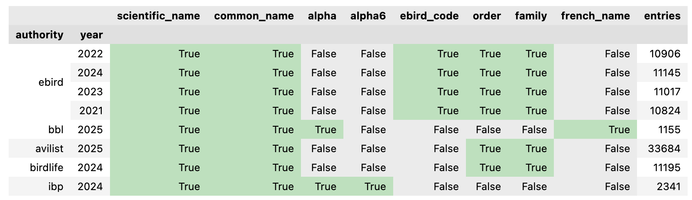

# BirdNames

A Python package for managing avian taxonomy and converting between different bird name formats across multiple taxonomic authorities.

## Features

- Convert between scientific names, common names, 4-letter alpha codes, 6-letter alpha codes, and species codes
- Support for multiple taxonomic authorities: AviList, eBird/Clements, BirdLife, and IBP
- Cross-authority conversions using scientific names as bridge
- Hierarchical conversions (species → genus → family → order)
- Optional fuzzy matching for handling typos and variations
- Batch processing support for lists, numpy arrays, and pandas Series

## Installation

```bash
pip install birdnames
```

## Quick Start

### Convert a desired type from any starting type
These functions find the best matching taxonomy and naming type for the input, and convert to the desired output

```python

import birdnames as bn
bn.alpha(['American Robin','Northern Cardinal'])
bn.scientific(['AMRO','NOCA'])
bn.common(['AMRO','NOCA'])
bn.ebird(['Cardinalis cardinalis'])
```
### Use the Converter class for full control 
You can specify the name format and taxonomy for the source and output

```python
import birdnames as bn

# Basic conversion within same authority
converter = bn.Converter(
    from_type="common_name",
    to_type="scientific_name",
    from_authority="avilist"
)

result = converter.convert("American Robin")
print(result)  # "Turdus migratorius"
```

### List available taxonomies with their included name types:

```python
bn.list_taxonomies()
```

If executed in a Jupyter notebook, this will display the following table:



## Supported Name Types

- `"scientific_name"`: Scientific/binomial names (e.g., "Turdus migratorius")
- `"common_name"`: English common names (e.g., "American Robin")
- `"genus"`: Genus names (e.g., "Turdus")
- `"family"`: Family names (e.g., "Turdidae") - not available for BBL
- `"order"`: Order names (e.g., "Passeriformes") - not available for BBL
- `"alpha"`: 4-letter alpha codes (IBP and BBL, e.g., "AMRO", "WEGR")
- `"alpha6"`: 6-letter alpha codes (IBP only, e.g., "TURMIG")
- `"ebird_code"`: eBird 6-letter species codes (eBird only, e.g., "amerob")
- `"french_name"`: French common names (BBL only, e.g., "Grèbe élégant")

## Supported Taxonomic Authorities

- `"avilist"`: AviList global unified bird taxonomy
- `"ebird"`: eBird/Clements Checklist
- `"birdlife"`: BirdLife International taxonomy
- `"ibp"`: Institute for Bird Populations (North American species)
- `"bbl"`: Bird Banding Lab (North American species with French names)


## Usage Examples

### Specify starting and ending name types 

For example, Common Name to Scientific Name

By default, AviList taxonomy is used

```python
import birdnames as bn

converter = bn.Converter(
    from_type="common_name",
    to_type="scientific_name",
)

# Single conversion
scientific_name = converter.convert("American Robin")
print(scientific_name)  # "Turdus migratorius"

# Batch conversion
common_names = ["American Robin", "Blue Jay", "Northern Cardinal"]
scientific_names = converter.convert(common_names)
print(scientific_names)
# ["Turdus migratorius", "Cyanocitta cristata", "Cardinalis cardinalis"]
```

### Hierarchical Conversions

```python
# Convert species to genus
converter = bn.Converter(
    from_type="scientific_name",
    to_type="genus"
)

genus = converter.convert("Turdus migratorius")
print(genus)  # "Turdus"

# Convert species to family
converter = bn.Converter(
    from_type="common_name",
    to_type="family",
    from_authority="avilist"
)

family = converter.convert("American Robin")
print(family)  # "Turdidae"

# Convert species to order
converter = bn.Converter(
    from_type="scientific_name",
    to_type="order",
    from_authority="avilist"
)

order = converter.convert("Turdus migratorius")
print(order)  # "Passeriformes"
```


### Working with Pandas DataFrames

```python
import pandas as pd
import birdnames as bn

# Create sample data
df = pd.DataFrame({
    'common_name': ['American Robin', 'Blue Jay', 'Northern Cardinal']
})

# Convert to scientific names
converter = bn.Converter(
    from_type="common_name",
    to_type="scientific_name",
    from_authority="avilist"
)

df['scientific_name'] = converter.convert(df['common_name'])
print(df)
```


### Common Name to 4-Letter Alpha Codes (IBP)

```python
# Convert common names to 4-letter alpha codes
converter = bn.Converter(
    from_type="common_name",
    to_type="alpha",
    from_authority="avilist",
    to_authority="ibp"
)

alpha_code = converter.convert("American Robin")
print(alpha_code)  # "AMRO"

# Batch conversion
common_names = ["American Robin", "Blue Jay", "Northern Cardinal"]
alpha_codes = converter.convert(common_names)
print(alpha_codes)  # ["AMRO", "BLJA", "NOCA"]
```


### Fuzzy (approximate) and Soft name matching

Fuzzy matching tries to match text with potential typos,
and is NOT enabled by default

```python
# Enable fuzzy matching for typos
converter = bn.Converter(
    from_type="common_name",
    to_type="scientific_name",
    from_authority="avilist",
    fuzzy_matching=True
)

result = converter.convert("Amercan Robin")  # Note the typo
print(result)  # "Turdus migratorius"
```

Soft matching means matching while ignoring case and spacing,
and is enabled by default. 
If you only want to match exact strings, turn off soft matching
```python
# Disable soft matching (enforce exact case and whitespace match)
converter = bn.Converter(
    from_type="common_name",
    to_type="scientific_name",
    from_authority="avilist",
    soft_matching=False
)
```

### Finding Typos in DataFrames with Fuzzy Matching

```python
import pandas as pd
import birdnames as bn

# Create sample data with some typos
df = pd.DataFrame({
    'original_name': [
        'American Robin',      # correct
        'Amercan Robin',       # typo: missing 'i'
        'Blue Jay',            # correct
        'Blu Jay',             # typo: missing 'e'
        'Northern Cardinal',   # correct
        'Nothern Cardinal',    # typo: missing 'r'
        'Red-winged Blackbird', # correct
        'Red-wingd Blackbird'  # typo: missing 'e'
    ]
})

# Use fuzzy matching to find corrected names
converter = bn.Converter(
    from_type="common_name",
    to_type="common_name",
    from_authority="avilist",
    fuzzy_matching=True
)

# Apply fuzzy matching to get corrected names
df['corrected_name'] = converter.convert(df['original_name'])

# Subset to show only rows with typos
df[df["original_name"] != df["corrected_name"]]

# Output:
#     original_name    corrected_name
# 1    Amercan Robin    American Robin
# 3          Blu Jay          Blue Jay
# 5  Nothern Cardinal Northern Cardinal
# 7 Red-wingd Blackbird Red-winged Blackbird
```


### BBL Alpha Codes and French Names

```python
# Convert to BBL 4-letter alpha codes
converter = bn.Converter(
    from_type="common_name",
    to_type="alpha",
    to_authority="bbl"
)

alpha_code = converter.convert("Western Grebe")
print(alpha_code)  # "WEGR"

# Convert to French names
converter_french = bn.Converter(
    from_type="common_name",
    to_type="french_name",
    to_authority="bbl"
)

french_name = converter_french.convert("Western Grebe")
print(french_name)  # "Grèbe élégant"
```

### Common Name to eBird Species Codes

```python
# Convert common names to eBird species codes
converter = bn.Converter(
    from_type="common_name",
    to_type="ebird_code",
    from_authority="avilist",
    to_authority="ebird"
)

ebird_code = converter.convert("American Robin")
print(ebird_code)  # "amerob"

# Batch conversion
common_names = ["American Robin", "Blue Jay", "Northern Cardinal"]
ebird_codes = converter.convert(common_names)
print(ebird_codes)  # ["amerob", "blujay", "norcar"]
```

### Cross-Authority Conversions
Specify the starting and ending authority, and optionally a specific year of the taxonomy to use. 

```python
# Convert eBird species codes to IBP alpha codes
converter = bn.Converter(
    from_type="ebird_code",
    to_type="alpha",
    from_authority="ebird",
    to_authority="ibp",
    from_year=2021
)

alpha_code = converter.convert("amerob")
print(alpha_code)  # "AMRO"
```


## Data Sources

The package integrates data from:

- **AviList**: Global unified bird taxonomy with scientific names, English common names, and taxonomic hierarchy
- **eBird/Clements**: Cornell Lab's taxonomy with common names and 6-letter species codes
- **BirdLife International**: Global taxonomy with IUCN Red List status
- **IBP**: Institute for Bird Populations with 4-letter and 6-letter alpha codes for North American species
- **BBL**: Bird Banding Lab with 4-letter alpha codes, English and French common names for North American species

## Development

### Data Ingestion

We currently support the latest of each taxonomy as of June 2025. We plan to add support for previous taxonomy versions and maintain support for new taxonomy versions in the future. We will provide API methods to specify which year of each taxonomy should be used.


A script is provided to fetch and ingest BBL taxonomy:
```bash
python data_ingestion/fetch_bbl_data.py
```

To update taxonomy data used by the package, first update the raw taxonomy files, then run the ingestion script:

```bash
python data_ingestion/ingest_taxonomies.py
```

This will process the raw taxonomy files and create standardized CSV files for the package.

### Testing

```bash
pytest tests/
```

## Release 
- run `poetry lock` to update lock file matching dependencies in `pyproject.toml`
- run tests with pytest
- update version nmber in `pyproject.toml`
- add tag with new version number
- publish to PyPi with twine

## License

MIT License

## Citation

If you use this package in your research, please cite:

```
Lapp, Sam 2025. BirdNames: A Python package for avian taxonomy management
```